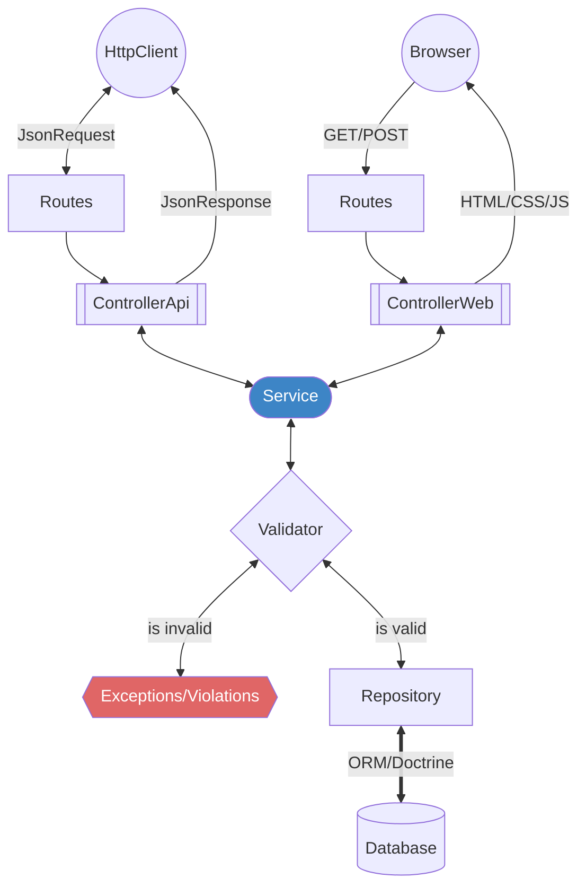

[](https://codecov.io/gh/secultce/aurora)

# Estrutura inicial Aurora

Este repositório fornece uma configuração base de aplicação Symfony com Docker, Nginx e PostgreSQL para substituir o projeto Aurora utilizado no Ceará.

A configuração já está dockerizada, então você só precisa ter o Docker Compose rodando na sua máquina para que tudo funcione corretamente.

## Tecnologias

- **PHP** 8.4
- **PostgreSQL** 16
- **MongoDB** 7
- **Symfony** 7
- **Aurora User Interface** 5.3 

## Links Rápidos
- [Acesse aqui para entender melhor nossa Stack](./help/STACK.md)
- [Acesse aqui para entender nossas decisões de backend](./help/TECHNICAL-DECISIONS.md)
- [Esquema do Banco de Dados](./help/DIAGRAM.md)
- [Como criar issues](./help/CREATE-ISSUES.md)
- [Como abrir Pull Requests](./help/CREATE-PULL-REQUESTS.md)
- [Nosso Fluxo de Desenvolvimento](./help/DEV-FLOW.md)
- [Enums](./help/ENUM.md)
- [Arquitetura da Aplicação](./help/README.md)
- [Comandos do terminal](./help/COMMANDS.md)
- [Deploy](./help/DEPLOY.md)

## Instalação 
<details>
<summary>Passo a passo</summary>

### Clonar o Repositório

Primeiro, clone o repositório usando SSH ou HTTPS:

```bash
git clone git@github.com:secultce/aurora.git
```
ou
```bash
git clone https://github.com/secultce/aurora.git
```

### Navegar para o Diretório do Projeto
Mude para o diretório do projeto:

```bash
cd aurora
```

---
>
> O jeito mais fácil é rodar o comando `make setup`, isso já vai executar todos os passos necessários e deixar a aplicação rodando em <http://localhost:8080>
>
```bash
cp .env.example .env
make setup
```
Mas se preferir, pode fazer o passo a passo abaixo, mas o compando de copiar o `.env` é obrigatório

---

### Iniciar os Contêineres Docker
Execute o Docker Compose para iniciar os contêineres:
```bash
docker compose up -d
```

### Instalar Dependências
Para instalar as dependências do projeto, entre no contêiner PHP:
```bash
docker compose exec -it php bash
```
**Agora é necessário executar alguns passos, nessa ordem, dentro do contêiner:**

1 - Instalação das dependências do PHP:
```bash
composer install
```

2 - Gerar os arquivos de Proxies do MongoDB:
```bash
php bin/console doctrine:mongodb:generate:proxie
```

3 - Executar as migrations do banco de dados
```bash
php bin/console doctrine:migrations:migrate -n
```

4 - Executar as fixtures (dados de teste) do banco de dados
```bash
php bin/console doctrine:fixtures:load -n
```

5 - Instalação das dependências do frontend:
```bash
php bin/console importmap:install
```

6 - Compilar os arquivos do frontend
```bash
php bin/console asset-map:compile
```

7 - Gerar as chaves de autenticação
```bash
php bin/console lexik:jwt:generate-keypair
```

### Uso

Depois que tudo estiver configurado e as dependências instaladas, você pode acessar a sua aplicação Symfony em [http://localhost:8080](http://localhost:8080).

Há também uma rota de teste para a API. Você pode acessá-la em [http://localhost:8080/api/example](http://localhost:8080/api/example). Esta rota está definida no controller `ExampleController` e retorna a mensagem de sucesso.

#### Usuário padrão
Há alguns usuários que você pode utilizar para fins de teste:

<table>
<tr>
<th>email</th>
<th>senha</th>
</tr>
<tr>
<td>mariadebetania@example.com</td>
<td>Aurora@2024</td>
</tr>
<tr>
<td>saracamilo@example.com</td>
<td>Aurora@2024</td>
</tr>
<tr>
<td>paulodetarso@example.com</td>
<td>Aurora@2024</td>
</tr>
</table>

</details>


## Desenvolvimento
<details>
<summary>Arquitetura e Decisões técnicas</summary>

Estamos utilizando o Symfony e o seu ecossistema de bibliotecas, porém a arquitetura é baseada em camadas e trata-se de um monolítico com a metodologia API First



- Para saber mais sobre as nossas decisões técnicas [acesse aqui](./help/TECHNICAL-DECISIONS.md)
- Para entender o nosso fluxo de desenvolvimento decisões técnicas [clique aqui](./help/DEV-FLOW.md)
</details>

## Design UI/UX
<details>
<summary>Informações importantes</summary>

### Prototipação das telas
A prototipagem das telas é feita por outro time, do RedeMapas, e se encontra [neste link do Figma](https://www.figma.com/design/HkR1qdfHPn4riffcBBOQwR/Prot%C3%B3tipos-%7C-Prioriza%C3%A7%C3%B5es?node-id=0-1&t=n23kLvhTSbEMELhz-0) 

### Componentes web
Há um fork do Bootstrap (framework css) com a implementação dos protótipos acima, se encontra [neste repositório](https://github.com/secultce/aurora-ui)

### Decisões de Design
Alguns protótipos implementados não estão seguindo a risca o design sugerido, por decisões totalmente técnicas que estão [documentadas aqui](https://github.com/secultce/aurora-ui/blob/main/help/design-decisions.md)
</details>

## Kubernetes: kubectl, Helm e Skaffold
<details>
<summary>Passo a passo de deploy</summary>

### Pré‑requisitos
- `Docker` e acesso a um registry (ou cluster local que aceite imagens locais).
- `kubectl` apontando para um cluster ativo (Kind, Minikube, K3d, ou cloud).
- `Helm` 3.12+.
- `Skaffold` v2+.

Estruturas relevantes no repositório:
- Chart Helm: `deploy/helm/nixpacks-cloudnative-app`.
- Skaffold: `skaffold.yaml` (usa `.nixpacks/Dockerfile`).

### Opção A) Skaffold (mais simples)
O Skaffold constrói a imagem e faz o deploy com Helm automaticamente.

1. Escolha um perfil de cluster:
   - Kind: `skaffold dev -p kind`
   - Minikube: `skaffold dev -p minikube`
   - Padrão (outros clusters): `skaffold dev`
   - Sem dependências (usa DB externos e desliga subcharts): `skaffold dev -p no-deps`

2. Acompanhe os logs. Quando pronto, acesse:
   - Perfis padrão/kind: `http://localhost:8080` (Skaffold faz `port-forward`).
   - Minikube: `minikube service mcm-nixpacks-cloudnative-app -n mcm` (perfil já troca o Service para `NodePort`).

Observações:
- A imagem é construída via Dockerfile em `.nixpacks/Dockerfile`.
- As variáveis de ambiente do app podem ser ajustadas em `deploy/helm/nixpacks-cloudnative-app/values.yaml` (seções `config` e `secrets`).
- Dependências gerenciadas via Bitnami charts: PostgreSQL, MongoDB e Mailpit (SMTP). O chart já inclui um template do Mailpit (sem dependência externa).
- Se o cluster não consegue puxar imagens externas (Bitnami deps), use o perfil `no-deps` e forneça `DATABASE_URL`, `MONGODB_URL` e `MONGODB_DB`.

### Opção B) Helm puro (sem Skaffold)
Use quando você já possui a imagem publicada em um registry acessível ao cluster.

1. Construa e publique a imagem:
```bash
docker build -t <REGISTRY>/mcm-app:<TAG> -f .nixpacks/Dockerfile .
docker push <REGISTRY>/mcm-app:<TAG>
```

2. Crie o namespace (se ainda não existir):
```bash
kubectl create namespace mcm || true
```

3. Faça o deploy com Helm:
```bash
helm upgrade --install mcm deploy/helm/nixpacks-cloudnative-app \
  -n mcm \
  --set image.repository=<REGISTRY>/mcm-app \
  --set image.tag=<TAG>
```

4. Exponha a aplicação:
   - Via port-forward (qualquer cluster):
```bash
kubectl -n mcm port-forward svc/mcm-nixpacks-cloudnative-app 8080:80
```
   - Ou em Minikube como NodePort:
```bash
helm upgrade --install mcm deploy/helm/nixpacks-cloudnative-app -n mcm \
  --set image.repository=<REGISTRY>/mcm-app --set image.tag=<TAG> \
  --set service.type=NodePort
minikube service mcm-nixpacks-cloudnative-app -n mcm
```

5. Acesse `http://localhost:8080` (port-forward) ou a URL retornada pelo Minikube.

Configuração de ambiente:
- Edite `deploy/helm/nixpacks-cloudnative-app/values.yaml`:
  - `config`: variáveis não sensíveis (ex.: `APP_ENV`, `PORT`, `STORAGE_*`, `EMAIL_ADDRESS`, etc.).
  - `secrets`: variáveis sensíveis (ex.: `APP_SECRET`, `JWT_PASSPHRASE`).
- Se não informar `DATABASE_URL`, `MONGODB_URL` e `MONGODB_DB`, o chart calcula automaticamente quando `postgresql.enabled`/`mongodb.enabled` estiverem `true`.
- Mailpit opcional: habilite `mailpit.enabled: true` para ter SMTP interno de desenvolvimento.

### Opção C) kubectl aplicando manifests renderizados
Gere os manifests com Helm e aplique com kubectl (útil para CI):
```bash
kubectl create namespace mcm || true
helm template mcm deploy/helm/nixpacks-cloudnative-app \
  -n mcm \
  --set image.repository=<REGISTRY>/mcm-app \
  --set image.tag=<TAG> | kubectl apply -n mcm -f -

kubectl -n mcm rollout status deploy/mcm-nixpacks-cloudnative-app
kubectl -n mcm port-forward svc/mcm-nixpacks-cloudnative-app 8080:80
```

### Dicas e troubleshooting
- Ver logs do app: `kubectl -n mcm logs -l app.kubernetes.io/name=nixpacks-cloudnative-app -f`.
- Ver pods/serviços: `kubectl -n mcm get pods,svc`.
- Ajuste recursos em `values.yaml` (`resources.requests/limits`).
- Em ambientes gerenciados, desabilite subcharts (`postgresql.enabled=false`, `mongodb.enabled=false`) e configure `DATABASE_URL`/`MONGODB_*` apontando para serviços externos.

</details>
